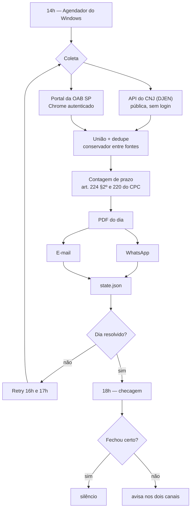

# Automação OAB — publicações do dia

[](https://nodejs.org)
[](LICENSE)

Todo dia às 14h, consulta as publicações do Diário da Justiça pela inscrição da OAB e manda o resultado por WhatsApp e e-mail, com PDF do inteiro teor anexo — e as datas de prazo já contadas.

O objetivo não é "automatizar uma consulta". É que **uma publicação não passada é prazo perdido**, e conferir o diário à mão todo dia é justamente o tipo de tarefa que falha no dia em que você está ocupado. Por isso cada decisão aqui assume que o erro é assimétrico: uma publicação repetida é chateação, uma publicação faltando é dano.

---

## Como funciona



Um dia só é **resolvido** quando as quatro coisas valem: saiu, saiu por todos os canais ligados, nenhuma fonte caiu ou veio pela metade, e a contagem bateu.

Mesmo assim, **os retries sempre coletam de novo**. Publicação entra no diário ao longo do dia, e "o dia já saiu" não significa "nada mais pode chegar" — quem decide se há o que enviar é o dedupe, não o estado. Sem novidade e sem canal pendente, o retry termina em silêncio.

Às 18h um **guarda-noturno** confere o estado e avisa se o dia não fechou. Ele existe porque silêncio significa duas coisas opostas: "não havia publicação" e "a automação falhou sem conseguir avisar".

## As duas fontes

| | API do CNJ (DJEN) | Portal da OAB SP |
|---|---|---|
| Acesso | pública, sem autenticação | login + Cloudflare Turnstile |
| Cobertura | DJEN | DJEN **+ diários de MG e da União** |
| Texto da intimação | inteiro teor | prévia cortada em ~986 caracteres |
| Confiabilidade | alta | depende de sessão viva no Chrome |

Elas são unidas, não escolhidas — e **nenhuma contém a outra**. Num dia medido, a API trouxe 5 publicações e o portal 7; das 7, duas só existiam no portal. Noutro foi ao contrário: a API trouxe 14 contra 11 do portal, porque inclui TRT e TRF que o caderno estadual não conta.

**Cada uma falha isolada**: se uma cai, a outra ainda entrega e a queda vira aviso em destaque — nunca um número menor sem explicação. Se as duas caem, aí é erro, porque um "0 publicações" silencioso é indistinguível de um dia realmente vazio.

O casamento entre fontes é por **identificador do documento** quando ele existe (o portal mostra o mesmo número que a API devolve como `id`) e, quando não existe, por **contenção** do texto — quanto do texto menor cabe dentro do maior. Não é Jaccard: como o portal corta a intimação, cinco pares reais da mesma publicação davam Jaccard de 0,18 a 0,82 e contenção de 0,97 a 1,00. Já **dentro** de uma mesma fonte nada é fundido: o mesmo processo pode ter duas intimações distintas no mesmo dia.

## Contagem de prazo

| Etapa | Regra |
|---|---|
| Disponibilização | dia em que o ato apareceu no DJe (vem da fonte) |
| Publicação | primeiro dia útil seguinte — **art. 224, §2º** |
| Contagem começa | primeiro dia útil após a publicação |
| Vencimento | em dias úteis, pulando feriado e recesso |

Feriados: nacionais fixos, móveis derivados da Páscoa pelo algoritmo de Meeus (carnaval, Sexta-feira Santa, Corpus Christi) e o **recesso de 20/12 a 20/01** (art. 220).

Feriado estadual, municipal e forense não tem fonte offline confiável — entra à mão em `FERIADOS_EXTRA`. **O erro aqui é assimétrico e vai para o lado que não parece:**

| Erro | Efeito | Consequência |
|---|---|---|
| **Faltou** feriado real | conta dia que não existia → vence **antes** | você age antes. Seguro |
| **Sobrou** feriado falso | pula dia útil real → vence **depois** | acha que tem tempo. **Perde o prazo** |

Por isso só entra data conferida no calendário do tribunal, e **todo vencimento que dependeu de uma delas sai dizendo que dependeu**. Feriado municipal vai em `FERIADOS_COMARCA`, amarrado ao código de origem do processo: o aniversário de uma cidade não é feriado na comarca vizinha, e aplicá-lo em todas empurraria o vencimento das outras para frente.

**O vencimento só é calculado quando o texto declara um único prazo.** Com mais de um, o robô lista os prazos e não arrisca data. Isso veio de um caso real: um despacho citava quatro prazos — cinco e trinta dias do *perito*, dez para os *esclarecimentos dele*, e quinze das partes que só corriam **depois da entrega do laudo**. Nenhum era do advogado naquele dia. Uma versão anterior escolhia o menor e teria estampado um vencimento que não existia. Data falsa não é cautela: gasta a confiança no aviso, e no dia em que o vencimento for verdadeiro ele vai parecer mais um palpite.

## Instalação

Requer **Node 22+** e Windows (o agendamento usa o Agendador de Tarefas).

```bash
npm install
cp .env.example .env      # preencha: OAB, canais, destinos
npm run setup:whatsapp    # QR Code, uma vez — sessão fica em .wwebjs_auth/
npm run register-task     # tarefas das 14h, 16h, 17h e 18h
```

Para ligar o portal como segunda fonte (`PORTAL=1` no `.env`), faça o primeiro login:

```bash
npm run abrir-chrome      # clique no Cloudflare e faça o login nessa janela
```

Depois disso o robô **abre o Chrome sozinho** quando precisa: a sessão fica salva em `chrome-profile/` e costuma durar semanas. Você só volta a essa janela se o Cloudflare exigir o desafio de novo ou a sessão cair — e o aviso chega pelos canais configurados.

O portal é lido por um Chrome **normal**, ao qual o robô se conecta por CDP. Não é preferência de estilo: um Chrome lançado pelo Playwright é reprovado pelo Turnstile mesmo com um humano clicando na caixa — as marcas de automação entregam o navegador. Quem clica no desafio é sempre você; o robô só lê a página autenticada.

## Comandos

| Comando | O que faz |
|---|---|
| `npm run dry` | Roda tudo e gera o PDF **sem enviar nada** |
| `npm run once` | Pipeline completo agora, com envio real |
| `npm run once -- --data=07/08/2026` | Força uma data específica |
| `npm run checar` | Confere se o dia fechou; avisa só se não fechou |
| `npm run teste` | 172 verificações (prazo, união, estado, saúde, feriados) |
| `npm run abrir-chrome` | Abre a janela do portal (login + Cloudflare) |
| `npm run inspecionar` | Conecta na janela aberta para conferir seletores |
| `npm run setup:whatsapp` | Reconecta o WhatsApp (novo QR) |
| `npm run register-task` | (Re)cria as tarefas agendadas |

Flags: `--dry`, `--data=dd/mm/aaaa`, `--retry` (coleta e só envia o que for novo), `--variantes` (varre os sufixos de inscrição da OAB).

## Estado

- [x] Fonte CNJ (DJEN) — paginação, retentativa, limite de requisição e limpeza do HTML
- [x] Fonte portal da OAB — paginação por postback e guard-rail de contagem
- [x] União das fontes com dedupe conservador
- [x] PDF, e-mail e WhatsApp independentes
- [x] Estado por dia + retries que sempre reconferem
- [x] Contagem de prazo, com feriado por comarca
- [x] Checagem diária que avisa quando o dia não fecha

Pendências e prioridade em **[docs/PENDENCIAS.md](docs/PENDENCIAS.md)**.

## Limites conhecidos

- **O robô não sabe de quem é o prazo.** A regra do prazo único evita o caso ruidoso, mas um ato com prazo único dirigido ao perito ainda sai como se fosse seu. Só leitura humana resolve.
- **`whatsapp-web.js` não confirma entrega.** `sendMessage()` devolve vazio contra a versão atual do WhatsApp Web; a mensagem chega, mas não há `ack` para conferir. O e-mail é a fonte da verdade.
- **Sábado, domingo e feriado não geram mensagem** quando não há publicação — são dias em que o diário não circula, e avisar "nada hoje" 104 vezes por ano é o jeito mais rápido de ensinar alguém a ignorar o alerta. Publicação que apareça num sábado sai normalmente.
- **PC desligado às 14h** = risco de perder o dia. A tarefa tem "executar assim que possível se perdida", o que cobre ligar mais tarde no mesmo dia.
- **A checagem das 18h mora na mesma máquina que ela vigia.** Cobre falha de parte; falha total (PC fora o dia inteiro, todos os canais mortos) só um vigia externo cobriria.
- **A API do CNJ limita requisição sem documentar o limite** e recusa IP fora do Brasil (HTTP 403).
- **O portal pode mudar de layout.** Os seletores preferem texto visível a IDs internos, que sobrevive melhor a redesenho.

## Aviso

Ferramenta de apoio. **Não substitui a conferência oficial** no diário e nos autos. Todo vencimento exibido é estimativa: não considera suspensão do tribunal, prazo em dobro, nem de quem é o prazo.

## Segurança

Credenciais, sessões e dados de processo **nunca** entram no repositório. O `.gitignore` cobre `.env` (senhas, inscrição, destinos), `chrome-profile/` (cookie de login), `.wwebjs_auth/` (sessão do WhatsApp, que vale como acesso à conta), `state.json`, `out/` e `logs/` (PDFs e dados de partes).

Os exemplos deste repositório usam números de processo e códigos de comarca fictícios.

---

## Documentação

| Documento | O que tem |
|---|---|
| **[PLANO.md](PLANO.md)** | Decisões de projeto, instalação detalhada, agendamento e diagnóstico de falhas |
| **[docs/PENDENCIAS.md](docs/PENDENCIAS.md)** | O que falta, em ordem de prioridade |
| **[docs/MELHORIAS.md](docs/MELHORIAS.md)** | Ideias com ganho, custo e risco — nada prometido |
