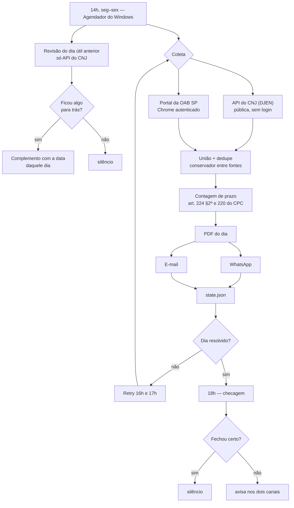

# Automação OAB — publicações do dia

[](https://nodejs.org)
[](LICENSE)

De segunda a sexta, às 14h, consulta as publicações do Diário da Justiça pela inscrição da OAB e manda o resultado por WhatsApp e e-mail, com PDF do inteiro teor anexo — e as datas de prazo já contadas.

O objetivo não é "automatizar uma consulta". É que **uma publicação não passada é prazo perdido**, e conferir o diário à mão todo dia é justamente o tipo de tarefa que falha no dia em que você está ocupado. Por isso cada decisão aqui assume que o erro é assimétrico: uma publicação repetida é chateação, uma publicação faltando é dano.

---

## Como funciona



Um dia só é **resolvido** quando as quatro coisas valem: saiu, saiu por todos os canais ligados, nenhuma fonte caiu ou veio pela metade, e a contagem bateu.

Mesmo assim, **os retries sempre coletam de novo**. Publicação entra no diário ao longo do dia, e "o dia já saiu" não significa "nada mais pode chegar" — quem decide se há o que enviar é o dedupe, não o estado. Sem novidade e sem canal pendente, o retry termina em silêncio.

Às 18h um **guarda-noturno** confere o estado e avisa se o dia não fechou. Ele existe porque silêncio significa duas coisas opostas: "não havia publicação" e "a automação falhou sem conseguir avisar".

### Revisão do dia anterior

O último retry é às 17h. Publicação que entre no diário depois disso não seria vista por ninguém: no dia seguinte o pipeline só olha a data corrente. Por isso **todo run reconfere antes o dia útil anterior** (`REVISAO_DIAS`, padrão 1; segunda-feira revisa a sexta) e manda o que tiver ficado para trás — como complemento, **com a data daquele dia**, nunca a de hoje: o prazo conta da disponibilização.

Ela reconfere **só a API do CNJ**, e isso está escrito na mensagem que sai. O portal exigiria abrir Chrome, autenticar e passar pela Cloudflare mais uma vez por dia, para um dia que quase sempre está em ordem — e cada abertura é mais uma chance de a sessão quebrar bem na hora do envio do dia corrente. Publicação que exista *apenas* nos diários de MG ou da União fica fora dessa conferência.

Três regras que a mantêm honesta:

- **roda depois do dia corrente**, nunca antes — o envio das 14h não espera a conferência de ontem, e um erro da revisão não é apagado pelo sucesso do dia;
- **entrega parcial fica registrada com nome**: se um canal falha, os ids entram no estado junto com *quem* já está em dia, e o run seguinte reenvia só para o canal que ficou para trás — a mesma regra do dia corrente. Antes nada era gravado, e um canal permanentemente caído fazia os três runs do dia remandarem o mesmo PDF pelo canal que funcionava, enquanto o caído perdia o complemento de vez quando o dia saía da janela;
- **não reescreve o passado**: os números do dia sobem pelo tanto que entrou, e um dia que fechou com o portal caído continua marcado assim — uma conferência que não olhou o portal não tem como absolvê-lo.

Numa instalação nova, sem nenhum dia no `state.json`, a revisão não roda: estado vazio significa "nunca rodou", não "falhou ontem". Essa medida é tirada **antes** de o dia corrente ser gravado — senão o histórico estaria sempre cheio e a porta nunca fecharia.

A conferência custa **uma consulta** por dia revisado. A varredura das seis variantes de sufixo da inscrição só dispara em dia que nunca saiu: num dia já entregue, base vazia apenas confirma o que o estado sabe, e as seis consultas extras comprariam risco de 429 justamente na fonte de que o envio do dia corrente depende.

Dia que a revisão **cria do zero** — o robô estava desligado naquele dia — nasce marcado como incompleto quando o portal está ligado: ele nunca foi consultado ali, e os diários de MG e da União só existem por ele. A mensagem também distingue os dois casos, porque as consequências são opostas: "entrou no diário depois do último envio" é complemento; "o robô não rodou naquele dia" é um dia inteiro que pede conferência à mão.

## As duas fontes

| | API do CNJ (DJEN) | Portal da OAB SP |
|---|---|---|
| Acesso | pública, sem autenticação | login + Cloudflare Turnstile |
| Cobertura | DJEN | DJEN **+ diários de MG e da União** |
| Texto da intimação | inteiro teor | prévia cortada em ~986 caracteres |
| Confiabilidade | alta | depende de sessão viva no Chrome |

O portal **corta a intimação em ~986 caracteres, em todas elas** — medido em 21/08/2026 contra as sete publicações de 19/08. Onde a publicação também vem da API, a união fica com o texto inteiro. Onde ela só existe no portal, o texto é buscado no DJEN **pelo número do processo**: a publicação some da consulta por inscrição quando você não está constituído ali, mas continua no diário, com inteiro teor e certidão. O que nem assim aparece — publicação exclusiva dos diários de MG ou da União — sai **dizendo que está cortada**, em vez de parecer inteira.

Elas são unidas, não escolhidas — e **nenhuma contém a outra**. Num dia medido, a API trouxe 5 publicações e o portal 7; das 7, duas só existiam no portal. Noutro foi ao contrário: a API trouxe 14 contra 11 do portal, porque inclui TRT e TRF que o caderno estadual não conta.

**Cada uma falha isolada**: se uma cai, a outra ainda entrega e a queda vira aviso em destaque — nunca um número menor sem explicação. Se as duas caem, aí é erro, porque um "0 publicações" silencioso é indistinguível de um dia realmente vazio.

O casamento entre fontes é por **identificador do documento** quando ele existe (o portal mostra o mesmo número que a API devolve como `id`) e, quando não existe, por **contenção** do texto — quanto do texto menor cabe dentro do maior. Não é Jaccard: como o portal corta a intimação, cinco pares reais da mesma publicação davam Jaccard de 0,18 a 0,82 e contenção de 0,97 a 1,00. Já **dentro** de uma mesma fonte nada é fundido: o mesmo processo pode ter duas intimações distintas no mesmo dia.

## Certidão oficial

Cada comunicação do DJEN traz um `hash`, e com ele o CNJ devolve a **certidão da intimação em PDF**, pública. O link sai no PDF e no e-mail, ao lado do texto.

Não é enfeite: o PDF que este projeto monta é conveniência nossa — um resumo montado por um robô, sem valor nos autos. A certidão é o documento. Ter o endereço dela ao lado de cada publicação é o que separa um aviso de uma prova.

Publicação que só existe nos diários de MG ou da União não tem certidão do CNJ, porque não passou pelo DJEN.

## Contagem de prazo

| Etapa | Regra |
|---|---|
| Disponibilização | dia em que o ato apareceu no DJe (vem da fonte) |
| Publicação | primeiro dia útil seguinte — **art. 224, §2º** |
| Contagem começa | primeiro dia útil após a publicação |
| Vencimento | em dias úteis, pulando feriado e recesso |

Feriados: nacionais fixos, móveis derivados da Páscoa pelo algoritmo de Meeus (carnaval, Sexta-feira Santa, Corpus Christi) e o **recesso de 20/12 a 20/01** (art. 220).

Feriado estadual, municipal e forense não tem fonte offline confiável — entra à mão em `FERIADOS_EXTRA`. **O erro aqui é assimétrico e vai para o lado que não parece:**

| Erro | Efeito | Consequência |
|---|---|---|
| **Faltou** feriado real | conta dia que não existia → vence **antes** | você age antes. Seguro |
| **Sobrou** feriado falso | pula dia útil real → vence **depois** | acha que tem tempo. **Perde o prazo** |

Por isso só entra data conferida no calendário do tribunal, e **todo vencimento que dependeu de uma delas sai dizendo que dependeu**. Feriado municipal vai em `FERIADOS_COMARCA`, amarrado ao código de origem do processo: o aniversário de uma cidade não é feriado na comarca vizinha, e aplicá-lo em todas empurraria o vencimento das outras para frente.

### De quem parece ser o prazo

Quando há um único prazo, o robô lê a frase antes dele e **marca a dúvida** se o sujeito for um auxiliar do juízo — perito, Ministério Público, contadoria, serventia, oficial de justiça, leiloeiro, administrador judicial, depositário, intérprete, curador especial.

Marca, nunca esconde: a data continua na tela, a publicação continua na lista, e o que se acrescenta é uma linha dizendo de quem o prazo parece ser. Um prazo classificado como "do perito" e omitido seria exatamente o modo de falhar que este projeto existe para evitar — há um teste com esse nome para travar a tentação.

Três decisões a mantêm quieta: **"réu", "autor" e "requerido" ficam de fora** (qualquer um deles pode ser o seu cliente); **vence quem está mais perto do prazo** (em *"o perito apresentará laudo; após, as partes serão intimadas no prazo de quinze dias"*, os quinze dias são das partes); e **prazo repetido com sujeitos diferentes cala a marcação** — marcar o sujeito errado é pior do que não marcar nenhum.

**O vencimento só é calculado quando o texto declara um único prazo.** Com mais de um, o robô lista os prazos e não arrisca data. Isso veio de um caso real: um despacho citava quatro prazos — cinco e trinta dias do *perito*, dez para os *esclarecimentos dele*, e quinze das partes que só corriam **depois da entrega do laudo**. Nenhum era do advogado naquele dia. Uma versão anterior escolhia o menor e teria estampado um vencimento que não existia. Data falsa não é cautela: gasta a confiança no aviso, e no dia em que o vencimento for verdadeiro ele vai parecer mais um palpite.

## Instalação

Requer **Node 22+** e Windows (o agendamento usa o Agendador de Tarefas).

```bash
npm install
cp .env.example .env      # preencha: OAB, canais, destinos
npm run setup:whatsapp    # QR Code, uma vez — sessão fica em .wwebjs_auth/
npm run register-task     # tarefas das 14h, 16h, 17h e 18h
```

Para ligar o portal como segunda fonte (`PORTAL=1` no `.env`), faça o primeiro login:

```bash
npm run abrir-chrome      # clique no Cloudflare, se aparecer; o resto é sozinho
```

O login segue **exatamente o caminho que se faz à mão**, e é isso que o robô repete quando a sessão cai:

1. abre `www.oabsp.org.br`
2. clica no **menu ☰** (as 3 barras, canto superior direito)
3. clica em **INTIMAÇÕES**
4. entra com a **senha salva** — a do perfil do Chrome, ou `OAB_USER`/`OAB_PASS` do `.env` se o campo vier vazio
5. clica em **Entrar**

Ir direto ao formulário de login não serve: o link de INTIMAÇÕES é que carrega a `ReturnUrl` que devolve ao Recorte Digital autenticado.

Depois disso o robô **abre o Chrome sozinho** quando precisa: a sessão fica salva em `chrome-profile/` e costuma durar semanas. Você só volta a essa janela se o Cloudflare exigir o desafio — esse clique é sempre seu. O Turnstile tem dois tipos e só um precisa de gente: o não-interativo passa sozinho em alguns segundos, e o robô espera por ele antes de pedir ajuda, em vez de desistir no primeiro olhar e mandar você clicar numa caixa que já havia sumido.

O portal é lido por um Chrome **normal**, ao qual o robô se conecta por CDP. Não é preferência de estilo: um Chrome lançado pelo Playwright é reprovado pelo Turnstile mesmo com um humano clicando na caixa — as marcas de automação entregam o navegador. Quem clica no desafio é sempre você; o robô só lê a página autenticada.

## Comandos

| Comando | O que faz |
|---|---|
| `npm run dry` | Roda tudo e gera o PDF **sem enviar nada** |
| `npm run once` | Pipeline completo agora, com envio real |
| `npm run once -- --data=07/08/2026` | Força uma data específica |
| `npm run checar` | Confere se o dia fechou; avisa só se não fechou |
| `node scripts/segunda-via.js [dd/mm/aaaa]` | Reenvia por WhatsApp um dia **já enviado**, a pedido |
| `npm run teste` | 265 verificações (prazo, união, estado, revisão, saúde, feriados, confirmação de envio) |
| `npm run abrir-chrome` | Abre a janela em `oabsp.org.br` (login + Cloudflare) |
| `npm run inspecionar` | Conecta na janela aberta para conferir seletores |
| `npm run setup:whatsapp` | Reconecta o WhatsApp (novo QR) |
| `npm run register-task` | (Re)cria as tarefas agendadas |

Ordem das publicações: quem tem **vencimento calculado vem primeiro**, o mais próximo na frente; depois prazo em horas, prazo ambíguo, sem prazo e, por último, data ilegível. A ordenação sai da coleta, uma vez só — o item 3 do PDF é o item 3 do WhatsApp e o item 3 do e-mail.

Flags: `--dry`, `--data=dd/mm/aaaa` (data pontual — não dispara a revisão da véspera), `--retry` (coleta e só envia o que for novo), `--variantes` (varre os sufixos de inscrição da OAB).

### Segunda via

`node scripts/segunda-via.js 18/08/2026` reenvia um dia que **já saiu**, quando alguém pede a mensagem de novo. Ela é deliberadamente marginal ao pipeline:

- **não escreve no `state.json`.** O dia já está gravado; forçar um envio por ali corromperia justamente o registro que decide o que ainda falta entregar;
- **não é complemento.** Complemento é "o que não estava no envio anterior"; aqui vai o dia inteiro, e tudo já foi entregue uma vez. O PDF e a mensagem dizem isso na primeira linha, para ninguém ler prazo novo onde não há;
- **não sobrescreve o PDF do dia.** Ele é o registro do que saiu na hora certa; a segunda via sai como arquivo separado, com a hora no nome.

## Estado

- [x] Fonte CNJ (DJEN) — paginação, retentativa, limite de requisição e limpeza do HTML
- [x] Fonte portal da OAB — paginação por postback e guard-rail de contagem
- [x] União das fontes com dedupe conservador
- [x] PDF, e-mail e WhatsApp independentes
- [x] Estado por dia + retries que sempre reconferem
- [x] Revisão do dia útil anterior na API do CNJ, antes de cuidar do dia de hoje
- [x] Contagem de prazo, com feriado por comarca
- [x] Checagem diária que avisa quando o dia não fecha
- [x] Segunda via a pedido, que não toca no estado nem no PDF do dia
- [x] Certidão oficial do CNJ em cada publicação do DJEN
- [x] Inteiro teor das publicações que o portal entrega cortadas (as que estão no DJEN)
- [x] Resumo ordenado por urgência — vencimento mais próximo na frente
- [x] Marcação de dúvida quando o prazo parece ser de um auxiliar do juízo

Pendências e prioridade em **[docs/PENDENCIAS.md](docs/PENDENCIAS.md)**.

## Limites conhecidos

- **O robô não sabe de quem é o prazo.** A regra do prazo único evita o caso ruidoso e a marcação de sujeito pega os casos escritos de forma direta, mas é leitura de texto e erra nos dois sentidos: um ato dirigido ao perito com a frase montada de outro jeito ainda sai como se fosse seu. Só leitura humana resolve.
- **O portal cai no run das 14h.** De 18 a 20/08/2026, todo dia: o desafio da Cloudflare não passava dentro do teto de espera, e só o retry das 16h trazia os diários de MG e da União. A espera subiu para 45s e a falha agora grava print e HTML — o próximo estouro diz se o desafio espera um clique ou só espera. Ver `docs/PENDENCIAS.md`.
- **`whatsapp-web.js` devolve vazio no `sendMessage()`** contra o WhatsApp Web 2.3000, e `getChats()`/`getChatById()` estouram com erro minificado. A confirmação vem do evento `message_ack`, que continua funcionando — o envio só é dado por feito com ack ≥ 1 (servidor recebeu). Sem ack, o canal fica pendente e o retry tenta de novo.
- **Sábado e domingo o robô não roda.** O diário não circula, e as tarefas são de segunda a sexta — nem o Chrome abre, nem a máquina acorda. Feriado ainda roda (não há lista confiável de feriado forense), mas não gera mensagem quando vem zero publicação: avisar "nada hoje" 104 vezes por ano é o jeito mais rápido de ensinar alguém a ignorar o alerta. Se quiser conferir um fim de semana à mão, `npm run once -- --data=16/08/2026` continua funcionando.
- **PC desligado às 14h** = risco de perder o dia. A tarefa tem "executar assim que possível se perdida", o que cobre ligar mais tarde no mesmo dia.
- **A checagem das 18h mora na mesma máquina que ela vigia.** Cobre falha de parte; falha total (PC fora o dia inteiro, todos os canais mortos) só um vigia externo cobriria.
- **A API do CNJ limita requisição sem documentar o limite** e recusa IP fora do Brasil (HTTP 403).
- **O portal pode mudar de layout.** Os seletores preferem texto visível a IDs internos, que sobrevive melhor a redesenho.

## Aviso

Ferramenta de apoio. **Não substitui a conferência oficial** no diário e nos autos. Todo vencimento exibido é estimativa: não considera suspensão do tribunal, prazo em dobro, nem de quem é o prazo.

## Segurança

Credenciais, sessões e dados de processo **nunca** entram no repositório. O `.gitignore` cobre `.env` (senhas, inscrição, destinos), `chrome-profile/` (cookie de login), `.wwebjs_auth/` (sessão do WhatsApp, que vale como acesso à conta), `state.json`, `out/` e `logs/` (PDFs e dados de partes).

Os exemplos deste repositório usam números de processo e códigos de comarca fictícios.

---

## Documentação

| Documento | O que tem |
|---|---|
| **[PLANO.md](PLANO.md)** | Decisões de projeto, instalação detalhada, agendamento e diagnóstico de falhas |
| **[docs/PENDENCIAS.md](docs/PENDENCIAS.md)** | O que falta, em ordem de prioridade |
| **[docs/MELHORIAS.md](docs/MELHORIAS.md)** | Ideias com ganho, custo e risco — nada prometido |
